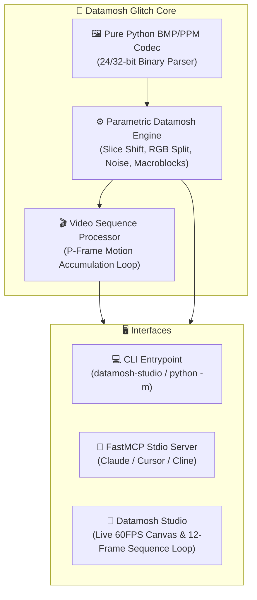

# 📼 Datamosh Glitch Studio

[](https://github.com/1nc0gn30/datamosh-glitch-studio/actions)
[](https://www.python.org/downloads/)
[](https://github.com/1nc0gn30/datamosh-glitch-studio)
[](https://modelcontextprotocol.io/)
[](https://opensource.org/licenses/MIT)

> **Parametric Datamosh, I-Frame Drop & Visual Glitch Synthesis Studio with Material 3 Web UI, Multi-OS CLI, FastMCP stdio server, and zero external runtime dependencies.**

---

## ✨ Features

- 📼 **Parametric Datamosh Engine**: Simulates authentic H.264 I-frame drops, P-frame motion vector smearing, RGB chromatic aberration channel splits, macroblock corruption, CRT/VCR scanlines, and sensor noise.
- 🎨 **Datamosh Studio Web UI**: Real-time glitch parameter controls, live canvas rendering, preset switcher, webcam stream moshing, and instant BMP frame export (design influenced by Material 3 tokens).
- ⚡ **Zero Third-Party Runtime Dependencies**: 100% Python Standard Library implementation (`struct`, `io`, `http.server`, `urllib`, `random`, `math`, `dataclasses`).
- 🤖 **FastMCP Server Protocol**: Full Model Context Protocol (MCP) JSON-RPC 2.0 stdio server for Claude Desktop, Cursor, Cline, and autonomous AI agents.
- 💻 **Cross-Platform CLI**: Complete multi-OS command-line interface with `--no-color` support, reproducible seeds, and batch processing.
- 🖼️ **Pure Python Codecs**: Built-in 24-bit/32-bit Windows BMP and Netpbm PPM (P6) binary decoders and encoders.

---

## 🚀 Quick Start

### Installation
```bash
# Clone the repository
git clone https://github.com/1nc0gn30/datamosh-glitch-studio.git
cd datamosh-glitch-studio

# Install in editable mode
pip install -e .
```

---

## 💻 CLI Usage

```bash
# Apply classic I-frame drop glitch to test card
datamosh-studio mosh -p h264_iframe_drop -o glitched.bmp

# Apply Cyberpunk VCR glitch to custom BMP image with reproducible seed
datamosh-studio mosh input.bmp -p cyberpunk_vcr --seed 1337 -o vcr_glitch.bmp

# Isolate Bitplanes 7, 6, 5 (MSBs) for high-order posterization glitch
datamosh-studio bitplane --keep-bits 7,6,5 -o bitplane_glitched.bmp

# Generate 8-panel SVG mosaic decomposing all bitplanes with activity ratios
datamosh-studio bitplane --mosaic bitplane_mosaic.svg

# Synthesize spatial Sierpiński boolean XOR fractal glitch texture
datamosh-studio xor --formula xor --scale 1.5 --blend 0.6 -o xor_glitched.bmp

# List available glitch presets
datamosh-studio presets

# Corrupt binary stream with bitflips while preserving 64-byte headers
datamosh-studio corrupt payload.bin --rate 0.005 -o corrupted.bin

# Launch Datamosh Studio Web UI (Material 3 influenced)
datamosh-studio serve --port 8098

# Start FastMCP stdio server for LLM agents
datamosh-studio mcp

# Run system diagnostics
datamosh-studio doctor
```

---

## 🎨 Presets Catalog

| Preset ID | Name | Core Aesthetic & Mechanics |
| :--- | :--- | :--- |
| `h264_iframe_drop` | **H.264 I-Frame Drop** | Missing keyframe compression artifacts, macroblock drag, motion smearing |
| `cyberpunk_vcr` | **Cyberpunk VCR Tracking** | Magnetic tape tracking errors, horizontal scanline roll, chromatic displacement |
| `rgb_split_overdrive` | **RGB Aberration Overdrive**| Extreme spatial separation of Red, Green, and Blue color channels |
| `analog_tape_decay` | **Analog Tape Decay** | Degraded magnetic tape, high noise floor, intermittent dropouts |
| `quantum_matrix_tear` | **Quantum Matrix Tear** | High-frequency macroblock corruption, payload bitflips, byte displacement |

---

## 🤖 Model Context Protocol (MCP) Setup

Add `datamosh-glitch-studio` to your Claude Desktop or Cursor configuration:

```json
{
  "mcpServers": {
    "datamosh-studio": {
      "command": "python3",
      "args": ["-m", "datamosh_glitch_studio", "mcp"]
    }
  }
}
```

### Registered MCP Tools:
- `datamosh_apply`: Apply glitch effects to Base64 image or procedural test pattern.
- `datamosh_bitplane_slice`: Isolate, mask, or invert bitplanes (0 LSB to 7 MSB) for digital posterization and solarization.
- `datamosh_sierpinski_xor`: Synthesize fractal spatial boolean glitch textures (XOR, AND, OR) across coordinate space.
- `datamosh_bitplane_mosaic`: Generate an 8-panel SVG mosaic displaying all bitplanes with active pixel statistics.
- `datamosh_motion_estimate`: Estimate macroblock optical displacement vectors and render ASCII/SVG vector maps.
- `datamosh_liquid_melt`: Synthesize multi-step liquid melting datamosh frame sequence with acceleration.
- `datamosh_generate_sequence`: Generate multi-frame animation demonstrating continuous I-frame motion smear.
- `datamosh_presets`: Query all presets and algorithmic parameters.
- `datamosh_corrupt_bytes`: Directly corrupt binary payloads with bitflips and noise.
- `datamosh_diagnostics`: Platform and engine health check.

---

## 📐 Mathematical Foundations & Compression Mechanics

### 1. Motion Vector Displacements & I-Frame Drops
In modern hybrid video codecs (MPEG-4, H.264, VP9), keyframes (I-frames) reset the full frame pixel state, while delta frames (P-frames) store only motion vectors $(\Delta x, \Delta y)$ and discrete cosine transform (DCT) error residuals:

$$F_t(x, y) = F_{t-1}(x + \Delta x_t(x, y), y + \Delta y_t(x, y)) + \text{Residual}_t(x, y)$$

When the I-frame is dropped from the GOP (Group of Pictures), the decoder applies the motion vectors of the new scene to the pixel buffers of the preceding scene, resulting in the iconic datamosh "pixel smear" artifact.

### 2. Chromatic Aberration & Channel Split
Simulates optical lens dispersion and magnetic tape tracking head desynchronization by spatially translating color channels independently:

$$\begin{cases}
R'(x, y) = R(x + \delta_x, y + \delta_y) \\
G'(x, y) = G(x, y) \\
B'(x, y) = B(x - \delta_x, y - \delta_y)
\end{cases}$$

### 3. CRT Scanline Attenuation Function
Simulates television cathode ray tube line scanning via harmonic brightness modulation:

$$I'(x, y) = I(x, y) \cdot \left(1 - \alpha \cdot \left|\sin\left(\frac{\pi y}{\lambda}\right)\right|\right)$$

where $\alpha \in [0, 1]$ controls scanline opacity and $\lambda$ is the scanline period in pixels.

---

## 🏛️ Architecture



---

## 🐍 Python SDK API Reference

```python
from datamosh_glitch_studio.frame_io import ImageFrame
from datamosh_glitch_studio.glitch_core import DatamoshEngine
from datamosh_glitch_studio.presets import get_preset

# 1. Create a synthetic test pattern or load a BMP
frame = ImageFrame.create(480, 320, color=(20, 30, 45))

# 2. Initialize Datamosh Engine
engine = DatamoshEngine()
preset = get_preset("cyberpunk_vcr")

# 3. Apply glitch synthesis
glitched_frame = engine.process_frame(frame, preset=preset, seed=1337)
bmp_bytes = glitched_frame.to_bmp()

# 4. Generate multi-frame motion vector smear loop
frames = [ImageFrame.create(320, 240) for _ in range(8)]
glitched_loop = engine.process_video_sequence(frames, preset=preset)
print(f"Generated {len(glitched_loop)} sequential motion frames.")
```

---

## 🧪 Running Tests

```bash
pytest -v
```

---

## 📜 License

MIT License © 2026 1nc0gn30

